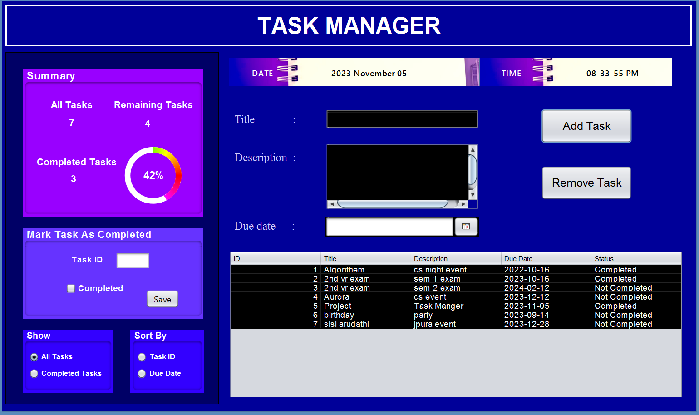

<div align="center">

# 📝 To-Do List Manager

### *Efficient Task Management with Custom Data Structures*


---

*A robust and user-friendly Java application that simplifies task organization through custom linked list implementation and smart sorting algorithms.*



</div>

---

## 🌟 Highlights

### ⚡ Performance
- Custom **linked list** implementation for O(1) insertions  
- Efficient **insertion sort** algorithm for sorting tasks  
- Optimized task retrieval and management operations  

### 💾 Reliability
- **Automatic data persistence** using text files  
- Built-in **backup system** for task storage  
- Ensures **no data loss** between sessions  

### 🎯 Smart Features
- **Auto-generated unique task IDs** for easy tracking  
- **Dual sorting options** — by ID and by due date  
- **Completion status tracking** to manage progress  

### 🎨 User Experience
- **Intuitive, user-friendly interface** design  
- **Clear visualization** of tasks and status  
- **Simple navigation** for all user levels  


---

## ✨ Features

| Feature | Description |
|---------|-------------|
| 🆕 **Task Management** | Add, delete, and update tasks seamlessly |
| 🔄 **Smart Sorting** | Sort by ID or due date using insertion sort |
| ✅ **Completion Tracking** | Mark tasks complete and filter by status |
| 💾 **Data Persistence** | Automatic save to text files |
| 🎯 **Unique IDs** | Auto-generated task identification |
| 🖥️ **User-Friendly UI** | Clean and intuitive interface |

---

### 📦 Project Structure

```
📁 src/
├── 📂 modelClasses/
│   ├── 📄 Task.java                    # Task entity with linked list node
│   └── 📄 TaskList.java                # Custom linked list implementation
├── 📂 ControllerClasses/
│   └── 📄 TaskListController.java      # Business logic layer
├── 📂 viewClasses/
│   └── 📄 MainInterface.form           # User interface layer
|   └── 📄 MainInterface.java
└── 📂 ToDoApp/
    └── 📄 Tasks.txt                    # Persistent storage
```

---

## 🔧 Core Components

### 📋 Task Class

```
┌─────────────────────────────────┐
│         Task Object             │
├─────────────────────────────────┤
│ • taskId: int                   │
│ • title: String                 │
│ • description: String           │
│ • dueDate: LocalDate            │
│ • isCompleted: boolean          │
│ • next: Task                    │
└─────────────────────────────────┘
```

**Key Methods:**
- `getId()` / `setId()` - Unique identifier management
- `getTitle()` / `setTitle()` - Task title operations
- `getDueDate()` / `setDueDate()` - Deadline management
- `isCompleted()` / `setCompleted()` - Status tracking

---

## 🚀 Getting Started

### Prerequisites

```bash
☑️ Java JDK 8 or higher
☑️ Java IDE (IntelliJ IDEA / Eclipse / NetBeans)
```

### 📥 Installation

```bash
# Clone the repository
git clone https://github.com/kavinduhcolombage/To-Do-Application.git

# Navigate to project directory
cd To-Do-Application/src/todolistapp

# Compile the application
javac ToDoListApp.java

# Run the application
java ToDoListApp
```

---

## 💡 Usage Guide

### 📝 Adding a Task
1. Select "Add Task" option
2. Enter task title and description
3. Set due date
4. Task automatically receives unique ID

### 🔍 Viewing Tasks
- Browse all tasks in sorted order
- Sort by ID or due date
- Filter completed/pending tasks

### ✅ Completing Tasks
- Enter task ID to mark as complete
- View completion status instantly
- Filter completed tasks separately

### 🗑️ Deleting Tasks
- Specify task ID to remove
- Automatic list reorganization
- Data file updated immediately

---

## 🎯 Technical Deep Dive

### Sorting Algorithm

**Insertion Sort** chosen for:
- ✅ Efficient for small to medium datasets
- ✅ Stable sorting (preserves order)
- ✅ Simple implementation
- ✅ In-place sorting (minimal memory)

### Data Persistence Strategy

```
User Action → Update Linked List → Write to File → Confirm Success
```

**Benefits:**
- 🔒 No data loss on application close
- 🔄 Easy backup and recovery
- 📊 Human-readable storage format
- 🚀 Quick load times

## 👨‍💻 Developer

<div align="center">

**D.K.H. Colombage**

</div>

---

## 🎓 Academic Context

This project demonstrates:
- ✅ Practical implementation of **Linked Lists**
- ✅ Understanding of **Sorting Algorithms**
- ✅ Application of **Data Structures** in real-world scenarios
- ✅ **Object-Oriented Programming** principles
- ✅ **File I/O** operations in Java

<div align="center">

### ⭐ If you find this project helpful, please give it a star!

**Made with ❤️ for learning and efficiency**

---

*Transforming task management through elegant data structures*

[](https://www.java.com/)
[](https://github.com)
[](https://github.com)

</div>
